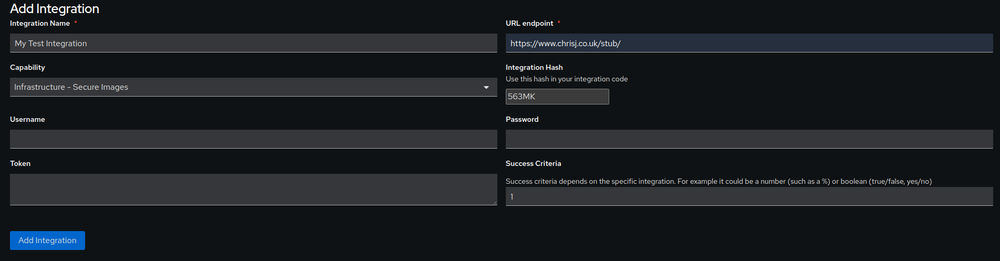

# crowsnest-integration-stub

From a JBang Quarkus Project.

Example integration for CrowsNest to a simple stub to demonstrate integrations


## jbang

You must install jbang first.

```shell script
curl -Ls https://sh.jbang.dev | bash -s - app setup
```

## Test stub
Check the stub is working and returning 1
```
$ curl -s https://www.chrisj.co.uk/stub/
1
```
## Edit crowsnestIntegrationStub.java
For the postgres connection, either hardcode in the password (bad practice!) or set a local environmental variable:

```
$ export PG_PASSWORD="mysecurePassword"
```
If using a shell variable, uncomment the relevant line:
```
String password = System.getenv("PG_PASSWORD");
// String password = "mysecurePassword";
```

## CrowsNest Seer
Create an integration on CrowsNest Seer with the relevant information



Make a note of the hash as you'll need this to run the integration. In this case, "563MK". Click "Add Integration"

The "Secure Images" capability be Red and the domain aperture should also be red 


## Run the integration with hash

```shell script
./jbang src/crowsnestIntegrationStub.java --hash 563MK
```
## Output
```
$ ./jbang src/crowsnestIntegrationStub.java --hash 563MK
[jbang] Building jar for crowsnestIntegrationStub.java...
[jbang] Post build with io.quarkus.launcher.JBangIntegration
Aug 09, 2024 9:44:31 AM org.jboss.threads.Version <clinit>
INFO: JBoss Threads version 3.4.3.Final
Aug 09, 2024 9:44:32 AM io.quarkus.deployment.QuarkusAugmentor run
INFO: Quarkus augmentation completed in 590ms
__  ____  __  _____   ___  __ ____  ______ 
 --/ __ \/ / / / _ | / _ \/ //_/ / / / __/ 
 -/ /_/ / /_/ / __ |/ , _/ ,< / /_/ /\ \   
--\___\_\____/_/ |_/_/|_/_/|_|\____/___/   
2024-08-09 09:44:32,671 INFO  [io.quarkus] (main) quarkus 999-SNAPSHOT on JVM (powered by Quarkus 2.16.2.Final) started in 0.207s. 
2024-08-09 09:44:32,694 INFO  [io.quarkus] (main) Profile prod activated. 
2024-08-09 09:44:32,694 INFO  [io.quarkus] (main) Installed features: [cdi, jdbc-postgresql, picocli]
Running compliance check for CrowsNest integration using hash 563MK 
Remote URL: https://www.chrisj.co.uk/stub/
Result: 1
Success criteria: 1
Flag updated to: Green
2024-08-09 09:44:34,218 INFO  [io.quarkus] (main) quarkus stopped in 0.007s
```
You can see that the result matches the success criterea so the flag has been updated to Green.

## Refresh the dashboard
Secure Images should be green and the main domain aperture should also be green


